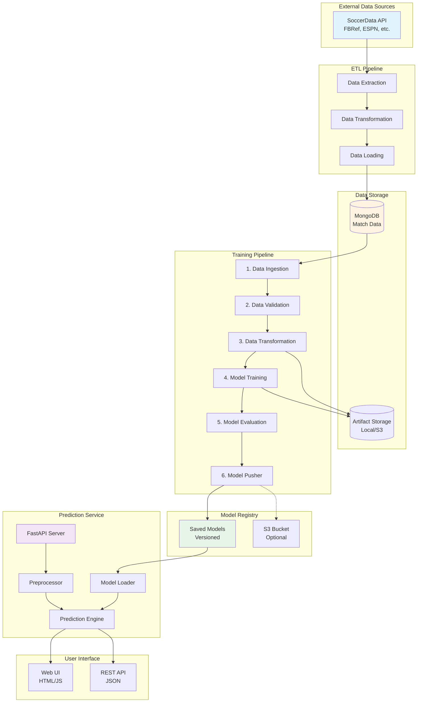
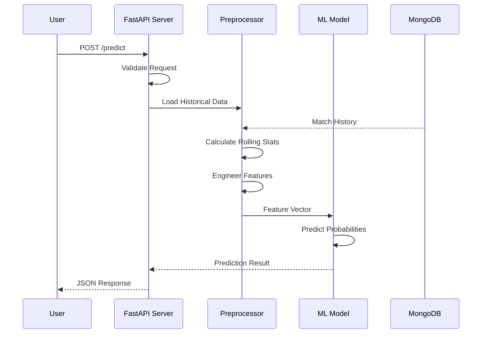
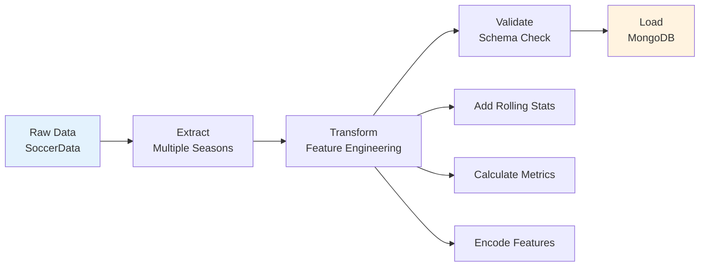
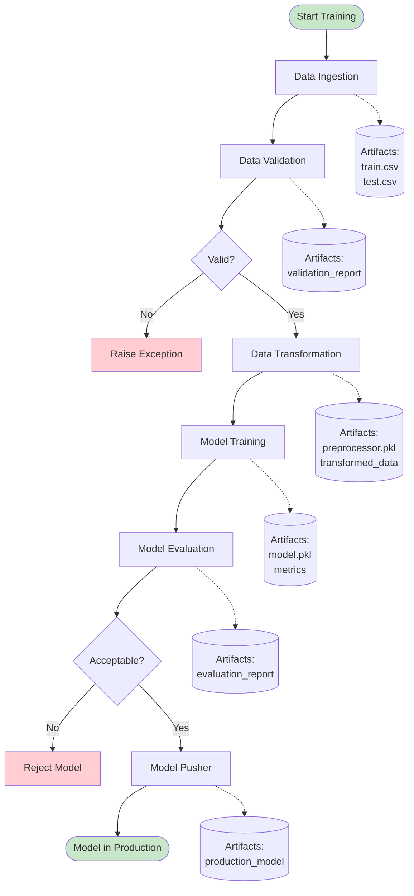
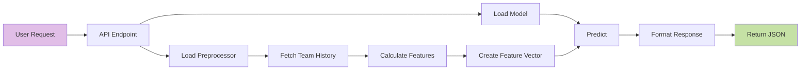
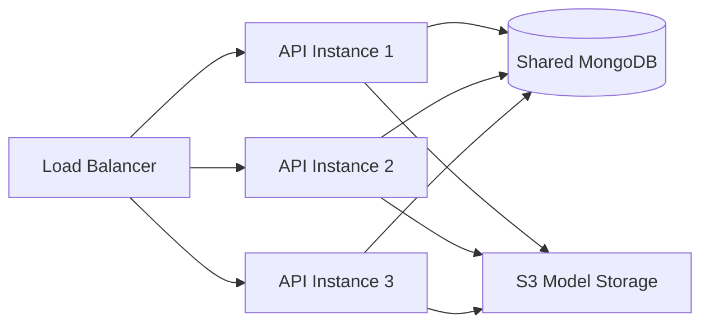
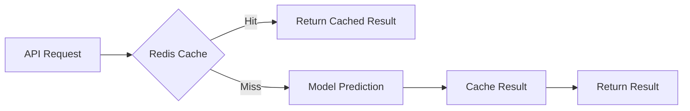
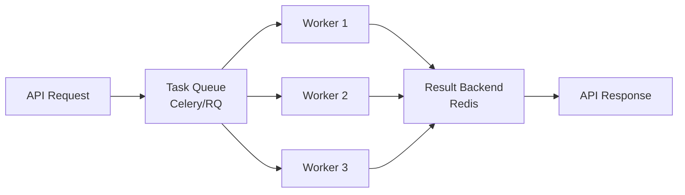

# 🏗️ Architecture Documentation

Detailed system architecture and design documentation for the Premier League Match Prediction ML project.

---

## Table of Contents

1. [System Overview](#system-overview)
2. [Architecture Diagram](#architecture-diagram)
3. [Data Flow](#data-flow)
4. [Pipeline Components](#pipeline-components)
5. [Technology Stack](#technology-stack)
6. [Design Decisions](#design-decisions)
7. [Scalability & Performance](#scalability--performance)

---

## System Overview

The Premier League Match Prediction system is an **end-to-end MLOps pipeline** that automates the entire workflow from raw data extraction to production-ready predictions. The architecture follows a modular, component-based design that ensures:

- **Separation of Concerns**: Each component has a single, well-defined responsibility
- **Reproducibility**: Consistent results across different environments
- **Maintainability**: Easy to update, debug, and extend
- **Scalability**: Can handle increasing data volumes and prediction requests

### Key Characteristics

- **Modular Design**: Independent, reusable components
- **Artifact-Based**: Each stage produces artifacts consumed by the next
- **Configuration-Driven**: YAML-based configuration for flexibility
- **Logging & Monitoring**: Comprehensive logging at every stage
- **Error Handling**: Robust exception handling and recovery

---

## Architecture Diagram

### High-Level Architecture



### Component Interaction Flow



---

## Data Flow

### 1. ETL Pipeline Flow



**Steps:**
1. **Extract**: Fetch match data from soccerdata API for specified seasons
2. **Transform**: 
   - Parse and clean data
   - Calculate rolling statistics (goals, shots, etc.)
   - Engineer team performance metrics
   - Create time-based features
3. **Validate**: Check against schema.yaml
4. **Load**: Store in MongoDB with proper indexing

### 2. Training Pipeline Flow



### 3. Prediction Flow



---

## Pipeline Components

### ETL Pipeline Components

#### 1. Data Extraction (`ETL/data_extraction.py`)

**Purpose**: Fetch raw match data from external sources

**Key Functions:**
- `extract_season_data(season)`: Extract data for a specific season
- Uses `soccerdata` library to fetch from multiple sources (FBRef, ESPN)

**Output**: Raw pandas DataFrame with match statistics

#### 2. Data Transformation (`ETL/data_transformation.py`)

**Purpose**: Transform raw data into ML-ready features

**Key Operations:**
- Calculate rolling statistics (last 5, 10 matches)
- Compute team performance metrics
- Engineer match context features
- Handle missing values
- Encode categorical variables

**Output**: Transformed DataFrame with engineered features

#### 3. Data Loading (`ETL/data_load.py`)

**Purpose**: Load processed data into MongoDB

**Key Functions:**
- `load_to_mongodb(df, collection)`: Bulk insert with error handling
- Create indexes for efficient querying
- Handle duplicates

**Output**: Data stored in MongoDB

#### 4. ETL Pipeline Orchestrator (`ETL/etl_pipeline.py`)

**Purpose**: Coordinate the complete ETL process

**Workflow:**
```python
for season in seasons:
    raw_data = extract(season)
    transformed_data = transform(raw_data)
    load(transformed_data)
```

---

### Training Pipeline Components

#### 1. Data Ingestion (`src/components/data_ingestion.py`)

**Purpose**: Fetch data from MongoDB and create train/test splits

**Configuration**: `DataIngestionConfig`
- MongoDB connection details
- Train/test split ratio
- Output paths

**Artifacts**: `DataIngestionArtifact`
- `trained_file_path`: Path to training data
- `test_file_path`: Path to test data

**Process:**
1. Connect to MongoDB
2. Fetch all match records
3. Split into train (80%) and test (20%)
4. Save as CSV files
5. Return artifact with file paths

#### 2. Data Validation (`src/components/data_validation.py`)

**Purpose**: Validate data against expected schema

**Configuration**: `DataValidationConfig`
- Schema file path (`config/schema.yaml`)
- Validation report path

**Artifacts**: `DataValidationArtifact`
- `validation_status`: Boolean (pass/fail)
- `validation_report_file_path`: Detailed report

**Validation Checks:**
- ✅ All required columns present
- ✅ Correct data types
- ✅ No unexpected columns
- ✅ Value ranges within bounds
- ✅ No excessive missing values

#### 3. Data Transformation (`src/components/data_transformation.py`)

**Purpose**: Prepare data for model training

**Configuration**: `DataTransformationConfig`
- Preprocessor output path
- Transformed data paths

**Artifacts**: `DataTransformationArtifact`
- `transformed_trained_file_path`: Transformed training data
- `transformed_test_file_path`: Transformed test data
- `preprocessor_path`: Saved preprocessor object

**Transformations:**
1. **Feature Engineering**:
   - Rolling statistics (goals, shots, corners, etc.)
   - Team form indicators
   - Head-to-head history
   
2. **Encoding**:
   - One-hot encoding for teams
   - Label encoding for target variable
   
3. **Scaling**:
   - StandardScaler for numerical features
   
4. **Handling Imbalance**:
   - SMOTE for minority class oversampling

#### 4. Model Training (`src/components/model_trainer.py`)

**Purpose**: Train machine learning model

**Configuration**: `ModelTrainingConfig`
- Model type and hyperparameters
- Output model path

**Artifacts**: `ModelTrainingArtifact`
- `trained_model_path`: Path to trained model
- `train_accuracy`: Training accuracy
- `test_accuracy`: Test accuracy

**Process:**
1. Load transformed data
2. Initialize model (e.g., RandomForestClassifier, XGBoost)
3. Train on training data
4. Evaluate on test data
5. Save model using pickle/dill
6. Log metrics

**Model Options:**
- Random Forest Classifier
- XGBoost Classifier
- Gradient Boosting Classifier

#### 5. Model Evaluation (`src/components/model_evaluation.py`)

**Purpose**: Evaluate model performance and compare with previous versions

**Configuration**: `ModelEvaluationConfig`
- Acceptance threshold
- Metrics to calculate

**Artifacts**: `ModelEvaluationArtifact`
- `is_model_accepted`: Boolean
- `accuracy`: Model accuracy
- `model_test_report_file_path`: Detailed metrics

**Evaluation Metrics:**
- Accuracy
- Precision (per class)
- Recall (per class)
- F1-Score (per class)
- Confusion Matrix
- ROC-AUC (if applicable)

**Acceptance Criteria:**
- Accuracy > threshold (e.g., 0.50)
- Better than previous model (if exists)
- No severe class imbalance in predictions

#### 6. Model Pusher (`src/components/model_pusher.py`)

**Purpose**: Deploy accepted model to production

**Configuration**: `ModelPusherConfig`
- Production model path
- S3 bucket (optional)

**Artifacts**: `ModelPusherArtifact`
- `is_model_pushed`: Boolean
- `saved_model_path`: Production model location
- `model_pusher_dir`: Pusher artifact directory

**Process:**
1. Check if model is accepted
2. Copy model to `saved_models/` directory
3. Optionally upload to S3
4. Update model version metadata
5. Log deployment details

---

### Prediction Components

#### Preprocessor (`src/utils/prediction_preprocessor.py`)

**Purpose**: Prepare input data for prediction

**Class**: `EPLMatchPredictorPreprocessor`

**Key Methods:**
- `load_data()`: Load historical match data
- `make_prediction_row(home_team, away_team, match_date)`: Create feature vector
- `calculate_rolling_stats(team)`: Compute team statistics

**Features Generated:**
- Recent form (last 5, 10 matches)
- Goals scored/conceded
- Shots, shots on target
- Corners, fouls, cards
- Home/away performance
- Head-to-head history

#### Model Loader (`app.py`)

**Purpose**: Load and cache trained model

**Functions:**
- `load_model()`: Load model from disk with caching
- `get_preprocessor()`: Initialize preprocessor with caching

**Caching Strategy:**
- Models loaded once at startup
- Cached in memory for fast predictions
- Reloaded only if file changes

---

## Technology Stack

### Core Technologies

| Component | Technology | Purpose |
|-----------|-----------|---------|
| **Language** | Python 3.8+ | Primary development language |
| **Web Framework** | FastAPI | REST API and web server |
| **ML Library** | scikit-learn | Model training and evaluation |
| **Data Processing** | Pandas, NumPy | Data manipulation |
| **Database** | MongoDB | NoSQL storage for match data |
| **Server** | Uvicorn | ASGI server for FastAPI |

### Data & Storage

| Component | Technology | Purpose |
|-----------|-----------|---------|
| **Data Source** | soccerdata | Fetch football match data |
| **Database** | MongoDB | Store historical match data |
| **Cloud Storage** | AWS S3 (optional) | Model artifact storage |
| **Serialization** | pickle, dill | Model persistence |

### ML & Data Science

| Component | Technology | Purpose |
|-----------|-----------|---------|
| **ML Framework** | scikit-learn 1.6.1 | Classification models |
| **Imbalance Handling** | imbalanced-learn | SMOTE, class balancing |
| **Validation** | Pydantic | Data validation |
| **Configuration** | PyYAML | Config management |

### Development & Deployment

| Component | Technology | Purpose |
|-----------|-----------|---------|
| **Containerization** | Docker | Application packaging |
| **Logging** | Python logging | Application monitoring |
| **Templates** | Jinja2 | HTML rendering |
| **Static Files** | FastAPI StaticFiles | Serve CSS/JS |

---

## Design Decisions

### 1. **Why FastAPI?**

**Decision**: Use FastAPI instead of Flask or Django

**Rationale:**
- ✅ **Performance**: ASGI-based, async support
- ✅ **Auto Documentation**: Swagger UI out-of-the-box
- ✅ **Type Safety**: Pydantic integration
- ✅ **Modern**: Python 3.8+ features
- ✅ **Easy Testing**: Built-in test client

### 2. **Why MongoDB?**

**Decision**: Use MongoDB instead of PostgreSQL/MySQL

**Rationale:**
- ✅ **Flexible Schema**: Match data structure can evolve
- ✅ **JSON-like**: Natural fit for nested data
- ✅ **Scalability**: Horizontal scaling support
- ✅ **Fast Reads**: Optimized for read-heavy workloads

### 3. **Why Artifact-Based Pipeline?**

**Decision**: Each component produces artifacts consumed by the next

**Rationale:**
- ✅ **Reproducibility**: Can replay any stage
- ✅ **Debugging**: Inspect intermediate outputs
- ✅ **Modularity**: Components are independent
- ✅ **Versioning**: Track artifacts over time

### 4. **Why Separate ETL and Training Pipelines?**

**Decision**: Split data collection from model training

**Rationale:**
- ✅ **Separation of Concerns**: Different responsibilities
- ✅ **Flexibility**: Run ETL less frequently
- ✅ **Efficiency**: Don't re-fetch data for each training run
- ✅ **Scalability**: Can scale independently

### 5. **Why Model Caching?**

**Decision**: Cache loaded model in memory

**Rationale:**
- ✅ **Performance**: Avoid disk I/O on every request
- ✅ **Latency**: Sub-second predictions
- ✅ **Resource Efficiency**: Load once, use many times

---

## Scalability & Performance

### Current Limitations

1. **Single Server**: API runs on one instance
2. **In-Memory Caching**: Limited by server RAM
3. **Synchronous Predictions**: One at a time
4. **No Load Balancing**: Single point of failure

### Scaling Strategies

#### Horizontal Scaling



**Implementation:**
- Deploy multiple API instances
- Use load balancer (Nginx, AWS ALB)
- Share model storage (S3)
- Centralized MongoDB

#### Vertical Scaling

- Increase server resources (CPU, RAM)
- Use GPU for model inference (if using deep learning)
- Optimize model size (quantization, pruning)

#### Caching Strategies



**Implementation:**
- Redis for distributed caching
- Cache predictions for common matchups
- TTL-based cache invalidation

#### Async Processing



**Implementation:**
- Celery for async task processing
- Redis as message broker
- Background workers for predictions

### Performance Optimizations

1. **Model Optimization**:
   - Use lightweight models (pruning, quantization)
   - Feature selection to reduce dimensionality
   - Model compression techniques

2. **Database Optimization**:
   - Index frequently queried fields
   - Use aggregation pipelines
   - Implement read replicas

3. **API Optimization**:
   - Response compression (gzip)
   - Connection pooling
   - Request batching

4. **Monitoring**:
   - Prometheus for metrics
   - Grafana for visualization
   - ELK stack for log aggregation

---

## Security Considerations

### Current State

- ⚠️ No authentication
- ⚠️ CORS allows all origins
- ⚠️ No rate limiting
- ⚠️ No input sanitization beyond validation

### Recommended Improvements

1. **Authentication**:
   - API key authentication
   - OAuth2 / JWT tokens
   - Role-based access control

2. **Input Validation**:
   - Strict Pydantic models
   - SQL injection prevention (using ORM)
   - XSS protection

3. **Rate Limiting**:
   - Per-IP rate limits
   - API key quotas
   - DDoS protection

4. **HTTPS**:
   - SSL/TLS certificates
   - Secure headers
   - HSTS enforcement

---

## Future Enhancements

1. **Real-time Updates**: WebSocket support for live predictions
2. **Model Ensemble**: Combine multiple models for better accuracy
3. **A/B Testing**: Test different models in production
4. **Feature Store**: Centralized feature management
5. **MLflow Integration**: Experiment tracking and model registry
6. **CI/CD Pipeline**: Automated testing and deployment
7. **Monitoring Dashboard**: Real-time metrics and alerts

---

**Last Updated**: December 2025
