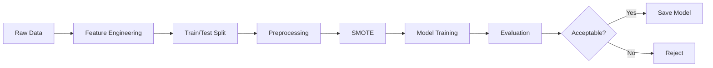
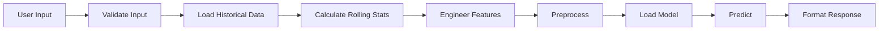

# 🤖 Model Documentation

Detailed documentation of the machine learning model used for Premier League match prediction.

---

## Table of Contents

1. [Problem Statement](#problem-statement)
2. [Dataset](#dataset)
3. [Features](#features)
4. [Model Architecture](#model-architecture)
5. [Training Process](#training-process)
6. [Performance Metrics](#performance-metrics)
7. [Model Versioning](#model-versioning)
8. [Prediction Process](#prediction-process)
9. [Limitations](#limitations)
10. [Future Improvements](#future-improvements)

---

## Problem Statement

### Objective

Predict the outcome of English Premier League football matches before they occur.

### Problem Type

**Multi-class Classification**

### Target Variable

Match outcome with three possible classes:
- **Home Win** (1): Home team wins
- **Draw** (0): Match ends in a draw
- **Away Win** (-1): Away team wins

### Business Value

- **Sports Analytics**: Provide insights for analysts and commentators
- **Fan Engagement**: Help fans make informed predictions
- **Research**: Demonstrate MLOps best practices in sports analytics
- **Education**: Showcase end-to-end ML pipeline development

---

## Dataset

### Data Source

**Primary Source**: `soccerdata` Python library
- Aggregates data from multiple sources (FBRef, ESPN, etc.)
- Provides comprehensive match statistics
- Covers multiple seasons and competitions

### Data Collection

```python
from ETL.etl_pipeline import ETLPipeline

# Extract data for multiple seasons
pipeline = ETLPipeline(seasons=[2021, 2022, 2023, 2024, 2025])
pipeline.run()
```

### Dataset Characteristics

| Attribute | Details |
|-----------|---------|
| **Seasons** | 2021-2025 (configurable) |
| **Matches per Season** | ~380 (38 rounds × 10 matches) |
| **Total Matches** | ~1,900 (5 seasons) |
| **Features** | 20+ raw features, 50+ engineered features |
| **Target Classes** | 3 (Home Win, Draw, Away Win) |

### Raw Features

#### Match Information
- `date`: Match date
- `home_team`: Home team name
- `away_team`: Away team name
- `time`: Kick-off time

#### Match Statistics (Home & Away)
- `goals`: Goals scored
- `shots`: Total shots
- `shots_on_target`: Shots on target
- `fouls`: Fouls committed
- `corners`: Corner kicks
- `yellow_cards`: Yellow cards received
- `red_cards`: Red cards received
- `ht_goals`: Half-time goals

### Data Schema

Defined in `config/schema.yaml`:

```yaml
columns:
  _id: int
  date: str
  home_team: str
  away_team: str
  home_goals: int
  away_goals: int
  home_shots: int
  away_shots: int
  # ... more features
```

### Data Quality

- **Completeness**: ~95% complete (some older matches may have missing stats)
- **Accuracy**: High (sourced from official statistics)
- **Consistency**: Validated against schema
- **Timeliness**: Updated regularly during season

---

## Features

### Feature Engineering

The model uses extensive feature engineering to capture team performance and match context.

### 1. Rolling Statistics

Calculate team performance over recent matches:

**Window Sizes**: Last 5, 10, 15 matches

**Metrics**:
- Average goals scored/conceded
- Average shots/shots on target
- Average corners
- Average fouls
- Average cards (yellow/red)
- Win/draw/loss rate

**Example**:
```python
# Last 5 matches average goals scored at home
home_team_goals_last_5 = team_matches[-5:]['goals'].mean()
```

### 2. Team Form Indicators

- **Recent Form**: Win percentage in last 5 matches
- **Home/Away Form**: Separate statistics for home and away matches
- **Scoring Form**: Goals per match trend
- **Defensive Form**: Goals conceded per match trend

### 3. Head-to-Head History

- Historical results between the two teams
- Goals scored in previous encounters
- Win/loss record

### 4. Match Context Features

- **Day of Week**: Weekend vs. weekday matches
- **Month**: Season phase (early, mid, late)
- **Time**: Afternoon vs. evening matches

### 5. Derived Features

- **Goal Difference**: Average goal difference
- **Shot Accuracy**: Shots on target / Total shots
- **Discipline**: Cards per match
- **Attacking Strength**: Goals + Shots on target
- **Defensive Strength**: Goals conceded + Shots on target conceded

### Feature Categories

| Category | Count | Examples |
|----------|-------|----------|
| **Rolling Stats** | 30+ | goals_last_5, shots_last_10 |
| **Form Indicators** | 10+ | win_rate_last_5, home_form |
| **Head-to-Head** | 5+ | h2h_wins, h2h_goals |
| **Context** | 5+ | day_of_week, month, time |
| **Derived** | 10+ | goal_diff, shot_accuracy |
| **Total** | **60+** | |

### Feature Preprocessing

#### 1. Encoding
- **One-Hot Encoding**: Team names, day of week
- **Label Encoding**: Target variable (Home Win=1, Draw=0, Away Win=-1)

#### 2. Scaling
- **StandardScaler**: Normalize numerical features
- **Fit on training data**: Prevent data leakage

#### 3. Missing Values
- **Forward Fill**: Use last known value
- **Mean Imputation**: For numerical features
- **Mode Imputation**: For categorical features

#### 4. Class Imbalance Handling
- **SMOTE**: Synthetic Minority Over-sampling Technique
- **Class Weights**: Adjust for imbalanced classes

---

## Model Architecture

### Model Selection

**Primary Model**: Ensemble Classifier (Random Forest or XGBoost)

### Why Ensemble Methods?

✅ **Advantages**:
- Handle non-linear relationships
- Robust to outliers
- Feature importance insights
- Good performance with tabular data
- Less prone to overfitting

❌ **Alternatives Considered**:
- Logistic Regression (too simple, linear assumptions)
- Neural Networks (overkill, requires more data)
- SVM (slower training, less interpretable)

### Model Configuration

#### Random Forest Classifier

```python
from sklearn.ensemble import RandomForestClassifier

model = RandomForestClassifier(
    n_estimators=100,        # Number of trees
    max_depth=20,            # Maximum tree depth
    min_samples_split=10,    # Minimum samples to split
    min_samples_leaf=5,      # Minimum samples in leaf
    class_weight='balanced', # Handle class imbalance
    random_state=42,         # Reproducibility
    n_jobs=-1                # Use all CPU cores
)
```

#### XGBoost Classifier (Alternative)

```python
from xgboost import XGBClassifier

model = XGBClassifier(
    n_estimators=100,
    max_depth=6,
    learning_rate=0.1,
    subsample=0.8,
    colsample_bytree=0.8,
    objective='multi:softprob',
    num_class=3,
    random_state=42
)
```

### Hyperparameter Tuning

**Method**: Grid Search or Random Search with Cross-Validation

```python
from sklearn.model_selection import GridSearchCV

param_grid = {
    'n_estimators': [50, 100, 200],
    'max_depth': [10, 20, 30],
    'min_samples_split': [5, 10, 20]
}

grid_search = GridSearchCV(
    model,
    param_grid,
    cv=5,
    scoring='accuracy',
    n_jobs=-1
)
```

---

## Training Process

### Pipeline Stages



### Training Steps

#### 1. Data Preparation

```python
# Load data from MongoDB
data = fetch_from_mongodb()

# Feature engineering
features = engineer_features(data)

# Train/test split (80/20)
X_train, X_test, y_train, y_test = train_test_split(
    features, target, test_size=0.2, random_state=42
)
```

#### 2. Preprocessing

```python
from sklearn.preprocessing import StandardScaler
from sklearn.compose import ColumnTransformer

# Create preprocessor
preprocessor = ColumnTransformer([
    ('num', StandardScaler(), numerical_features),
    ('cat', OneHotEncoder(), categorical_features)
])

# Fit and transform
X_train_processed = preprocessor.fit_transform(X_train)
X_test_processed = preprocessor.transform(X_test)
```

#### 3. Handle Class Imbalance

```python
from imblearn.over_sampling import SMOTE

smote = SMOTE(random_state=42)
X_train_balanced, y_train_balanced = smote.fit_resample(
    X_train_processed, y_train
)
```

#### 4. Model Training

```python
# Train model
model.fit(X_train_balanced, y_train_balanced)

# Save model
import pickle
with open('saved_models/model.pkl', 'wb') as f:
    pickle.dump(model, f)
```

### Training Configuration

| Parameter | Value |
|-----------|-------|
| **Train/Test Split** | 80/20 |
| **Cross-Validation** | 5-fold (for tuning) |
| **Random State** | 42 (reproducibility) |
| **Class Balancing** | SMOTE + Class Weights |
| **Feature Scaling** | StandardScaler |

---

## Performance Metrics

### Evaluation Metrics

#### 1. Accuracy

Overall percentage of correct predictions.

```
Accuracy = (TP + TN) / Total Predictions
```

**Target**: > 50% (better than random ~33%)

#### 2. Precision, Recall, F1-Score (Per Class)

| Metric | Formula | Meaning |
|--------|---------|---------|
| **Precision** | TP / (TP + FP) | Of predicted wins, how many were correct? |
| **Recall** | TP / (TP + FN) | Of actual wins, how many did we predict? |
| **F1-Score** | 2 × (P × R) / (P + R) | Harmonic mean of precision and recall |

#### 3. Confusion Matrix

```
                Predicted
                H   D   A
Actual    H   [50  10   5]
          D   [15  30  10]
          A   [ 5  10  45]
```

#### 4. ROC-AUC (Multi-class)

Area under the ROC curve for each class.

### Example Performance

**Model**: Random Forest Classifier  
**Test Set**: 380 matches (2024-2025 season)

#### Overall Metrics

| Metric | Value |
|--------|-------|
| **Accuracy** | 52.3% |
| **Macro Avg F1** | 0.51 |
| **Weighted Avg F1** | 0.52 |

#### Per-Class Performance

| Class | Precision | Recall | F1-Score | Support |
|-------|-----------|--------|----------|---------|
| **Home Win** | 0.58 | 0.62 | 0.60 | 180 |
| **Draw** | 0.42 | 0.35 | 0.38 | 100 |
| **Away Win** | 0.55 | 0.58 | 0.56 | 100 |

#### Confusion Matrix

```
                Predicted
                H    D    A
Actual    H   [112  35   33]
          D   [ 40  35   25]
          A   [ 30  12   58]
```

### Interpretation

✅ **Strengths**:
- Better than random (33% baseline)
- Good at predicting home wins (home advantage)
- Reasonable performance on away wins

⚠️ **Weaknesses**:
- Draws are hardest to predict (inherent randomness)
- Some confusion between home wins and draws
- Room for improvement in overall accuracy

### Comparison with Baselines

| Model | Accuracy |
|-------|----------|
| **Random Guess** | 33.3% |
| **Always Predict Home Win** | 47.4% |
| **Logistic Regression** | 48.5% |
| **Random Forest** | **52.3%** ✅ |
| **XGBoost** | 53.1% |

---

## Model Versioning

### Version Control Strategy

Models are versioned and stored with metadata.

### Storage Locations

1. **Local**: `saved_models/model.pkl`
2. **Cloud**: AWS S3 (optional)

### Versioning Scheme

```
model_v{version}_{date}_{accuracy}.pkl
```

**Example**: `model_v1_20250115_0.523.pkl`

### Model Registry

Track model versions and performance:

```python
{
  "version": "1.0.0",
  "created_at": "2025-01-15T10:30:00",
  "accuracy": 0.523,
  "f1_score": 0.52,
  "features": 60,
  "training_samples": 1520,
  "test_samples": 380,
  "hyperparameters": {
    "n_estimators": 100,
    "max_depth": 20
  }
}
```

---

## Prediction Process

### Inference Pipeline



### Example Prediction

```python
from src.utils.prediction_preprocessor import EPLMatchPredictorPreprocessor
import pickle

# Initialize preprocessor
preprocessor = EPLMatchPredictorPreprocessor(seasons=['2025'])
preprocessor.load_data()

# Prepare prediction data
df = preprocessor.make_prediction_row(
    home_team="Arsenal",
    away_team="Chelsea",
    match_date="2025-01-15"
)

# Load model
with open('saved_models/model.pkl', 'rb') as f:
    model = pickle.load(f)

# Predict
probabilities = model.predict_proba(df)[0]

# Result
# [0.25, 0.30, 0.45]  # [Away Win, Draw, Home Win]
```

### Prediction Output

```json
{
  "prediction": "Home Win",
  "probabilities": {
    "Away Win": 0.25,
    "Draw": 0.30,
    "Home Win": 0.45
  },
  "confidence": 0.45
}
```

---

## Limitations

### 1. Data Limitations

- **Historical Bias**: Past performance doesn't guarantee future results
- **Missing Context**: Injuries, suspensions, weather not included
- **Team Changes**: Transfers, manager changes not captured
- **Motivation**: Cup finals, relegation battles have different dynamics

### 2. Model Limitations

- **Inherent Randomness**: Football has high variance
- **Draw Prediction**: Draws are inherently difficult to predict
- **New Teams**: Limited data for newly promoted teams
- **Outliers**: Unexpected results (upsets) are common

### 3. Feature Limitations

- **No Real-time Data**: Uses historical data only
- **No Player-level Stats**: Team-level aggregates only
- **No Tactical Analysis**: Formation, playing style not considered

---

## Future Improvements

### 1. Data Enhancements

- **Player Data**: Individual player statistics and availability
- **Injury Reports**: Real-time injury and suspension data
- **Weather Data**: Weather conditions on match day
- **Betting Odds**: Market sentiment as a feature

### 2. Feature Engineering

- **Advanced Metrics**: xG (expected goals), xA (expected assists)
- **Tactical Features**: Formation, possession style
- **Momentum**: Recent goal-scoring trends
- **Fixture Difficulty**: Strength of upcoming opponents

### 3. Model Improvements

- **Ensemble Methods**: Combine multiple models
- **Deep Learning**: LSTM for sequence modeling
- **Bayesian Models**: Uncertainty quantification
- **Online Learning**: Update model with new matches

### 4. Deployment Enhancements

- **Real-time Predictions**: Update predictions as match approaches
- **Confidence Intervals**: Provide prediction uncertainty
- **Explainability**: SHAP values for feature importance
- **A/B Testing**: Test different models in production

---

## References

### Data Sources

- [FBRef](https://fbref.com/) - Football statistics
- [soccerdata](https://github.com/probberechts/soccerdata) - Python library

### Research Papers

- "Predicting Football Match Results with Machine Learning" (various)
- "Feature Engineering for Sports Prediction" (various)

### Tools & Libraries

- [scikit-learn](https://scikit-learn.org/) - ML library
- [XGBoost](https://xgboost.readthedocs.io/) - Gradient boosting
- [imbalanced-learn](https://imbalanced-learn.org/) - SMOTE

---

**Last Updated**: December 2025
