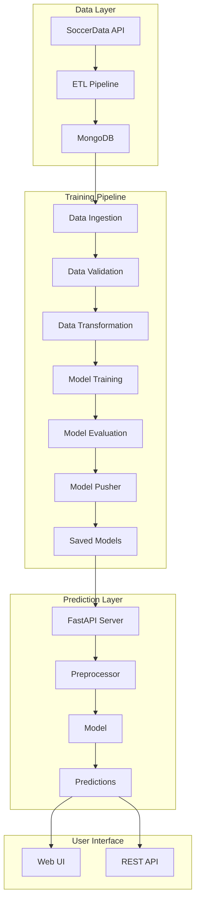

# ⚽ Premier League Match Prediction ML

[](https://www.python.org/)
[](https://fastapi.tiangolo.com/)
[](LICENSE)
[]()

An end-to-end **MLOps pipeline** for predicting English Premier League match outcomes using machine learning. This project features automated data processing, rolling statistics computation, model training, evaluation, versioning, and a production-ready FastAPI deployment.

---

## Project Note
This project focuses on building an end-to-end ETL pipeline and machine learning pipeline for sports match prediction. The model achieves **70%** accuracy, which is considered strong performance given the inherently unpredictable nature of sports outcomes.
The model is trained using the most recent five seasons of data and do predictions on the last 5 games avg stats , incorporating multiple relevant features to capture recent trends and performance patterns.
---

## 🌐 Live Application

You can try the live version of the Premier League Match Prediction app here:  

🔗 [Premier League Match Prediction App](https://premier-league-match-prediction-ml--aniqramzan5758.replit.app)
---

## 🌟 Key Features

- **🔄 Complete MLOps Pipeline**: End-to-end automated workflow from data ingestion to model deployment
- **📊 ETL Pipeline**: Automated data extraction from multiple seasons using `soccerdata` library
- **🎯 Advanced Feature Engineering**: Rolling statistics, team performance metrics, and match context features
- **🤖 ML Training Pipeline**: 6-stage modular pipeline (Ingestion → Validation → Transformation → Training → Evaluation → Pusher)
- **🚀 FastAPI REST API**: Production-ready API with automatic documentation
- **💾 Model Versioning**: Automated model storage and version management
- **📈 Real-time Predictions**: Predict match outcomes with probability distributions
- **🎨 Web Interface**: Interactive UI for making predictions
- **🔍 Data Validation**: Schema-based validation ensuring data quality
- **📝 Comprehensive Logging**: Detailed logging throughout the pipeline

---

## 🏗️ Architecture Overview



---

## 📁 Project Structure

```
Premier-League-Match-Prediction-ML/
├── app.py                          # FastAPI application
├── demo.py                         # Training pipeline demo script
├── requirements.txt                # Project dependencies
├── setup.py                        # Package setup configuration
├── Dockerfile                      # Docker configuration
│
├── config/
│   └── schema.yaml                 # Data validation schema
│
├── ETL/                            # ETL Pipeline
│   ├── data_extraction.py          # Extract data from soccerdata
│   ├── data_transformation.py      # Transform and engineer features
│   ├── data_load.py                # Load data to MongoDB
│   └── etl_pipeline.py             # Complete ETL orchestration
│
├── src/
│   ├── components/                 # ML Pipeline Components
│   │   ├── data_ingestion.py      # Fetch data from MongoDB
│   │   ├── data_validation.py     # Validate data schema
│   │   ├── data_transformation.py # Feature engineering
│   │   ├── model_trainer.py       # Train ML models
│   │   ├── model_evaluation.py    # Evaluate model performance
│   │   └── model_pusher.py        # Push model to production
│   │
│   ├── pipline/
│   │   └── training_pipeline.py   # Complete training orchestration
│   │
│   ├── entity/                     # Data classes
│   │   ├── config_entity.py       # Configuration entities
│   │   ├── artifact_entity.py     # Artifact entities
│   │   ├── estimator.py           # Model estimator
│   │   └── s3_estimator.py        # S3 model operations
│   │
│   ├── utils/                      # Utility modules
│   │   ├── main_utils.py          # Common utilities
│   │   └── prediction_preprocessor.py  # Prediction preprocessing
│   │
│   ├── configuration/              # Configuration modules
│   │   ├── mongo_db_connection.py # MongoDB connection
│   │   └── aws_connection.py      # AWS S3 connection
│   │
│   ├── data_access/
│   │   └── EPL_data.py            # Data access layer
│   │
│   ├── logger/                     # Logging configuration
│   └── exception/                  # Custom exceptions
│
├── artifact/                       # Training artifacts
├── saved_models/                   # Production models
├── logs/                           # Application logs
├── static/                         # Static files (CSS, JS)
├── templates/                      # HTML templates
└── notebooks/                      # Jupyter notebooks
```

---

## 🚀 Quick Start

### Prerequisites

- Python 3.8 or higher
- MongoDB (local or cloud instance)
- pip package manager
- Virtual environment (recommended)

### Installation

1. **Clone the repository**
   ```bash
   git clone https://github.com/aniq63/Premier-League-Match-Prediction-ML.git
   cd Premier-League-Match-Prediction-ML
   ```

2. **Create and activate virtual environment**
   ```bash
   # Windows
   python -m venv venv
   venv\Scripts\activate

   # Linux/Mac
   python3 -m venv venv
   source venv/bin/activate
   ```

3. **Install dependencies**
   ```bash
   pip install -r requirements.txt
   ```

4. **Install package in editable mode**
   ```bash
   pip install -e .
   ```

### Configuration

1. **Set up MongoDB connection**
   - Update MongoDB connection string in `src/configuration/mongo_db_connection.py`
   - Or set environment variable: `MONGODB_URL`

2. **Configure AWS S3 (Optional)**
   - Set AWS credentials if using S3 for model storage
   - Update `src/configuration/aws_connection.py`

---

## 💻 Usage

### 1. Run ETL Pipeline (First Time Setup)

Extract and load Premier League data into MongoDB:

```python
from ETL.etl_pipeline import ETLPipeline

# Extract data for multiple seasons
pipeline = ETLPipeline(seasons=[2021, 2022, 2023, 2024, 2025])
pipeline.run()
```

### 2. Run Training Pipeline

Train the machine learning model:

```python
from src.pipline.training_pipeline import Training_Piepline

# Initialize and run complete training pipeline
pipeline = Training_Piepline()
pipeline.run_pipeline()
```

Or use the demo script:

```bash
python demo.py
```

### 3. Start FastAPI Server

Launch the prediction API:

```bash
python app.py
```

Or using uvicorn directly:

```bash
uvicorn app:app --host 0.0.0.0 --port 8000 --reload
```

The API will be available at:
- **Web UI**: http://localhost:8000
- **API Docs**: http://localhost:8000/docs
- **ReDoc**: http://localhost:8000/redoc

---

## 🔌 API Endpoints

### Health Check
```bash
GET /health
```
Check API and model status

### Get Available Teams
```bash
GET /teams
```
Retrieve list of teams available for prediction

### Predict Match Outcome
```bash
POST /predict
Content-Type: application/json

{
  "home_team": "Arsenal",
  "away_team": "Chelsea",
  "match_date": "2025-01-15"
}
```

**Response:**
```json
{
  "home_team": "Arsenal",
  "away_team": "Chelsea",
  "match_date": "2025-01-15",
  "prediction": "Home Win",
  "probabilities": {
    "Away Win": 0.25,
    "Draw": 0.30,
    "Home Win": 0.45
  },
  "confidence": 0.45
}
```

### Example with cURL
```bash
curl -X POST "http://localhost:8000/predict" \
  -H "Content-Type: application/json" \
  -d '{
    "home_team": "Manchester City",
    "away_team": "Liverpool",
    "match_date": "2025-02-01"
  }'
```

### Example with Python
```python
import requests

url = "http://localhost:8000/predict"
data = {
    "home_team": "Manchester United",
    "away_team": "Tottenham",
    "match_date": "2025-03-10"
}

response = requests.post(url, json=data)
print(response.json())
```

---

## 🛠️ Technology Stack

### Core Technologies
- **Python 3.8+**: Primary programming language
- **FastAPI**: Modern web framework for building APIs
- **Scikit-learn**: Machine learning library
- **Pandas & NumPy**: Data manipulation and analysis

### Data & Storage
- **MongoDB**: NoSQL database for storing match data
- **soccerdata**: Library for fetching football data
- **AWS S3**: Cloud storage for model artifacts (optional)

### ML Pipeline
- **imbalanced-learn**: Handling class imbalance
- **PyYAML**: Configuration management
- **dill**: Advanced object serialization

### API & Web
- **Uvicorn**: ASGI server
- **Jinja2**: Template engine
- **Pydantic**: Data validation

### Development Tools
- **from_root**: Root directory management
- **logging**: Comprehensive logging
- **Custom exception handling**: Robust error management

---

## 📊 ML Pipeline Stages

### 1. **Data Ingestion**
- Fetches data from MongoDB
- Splits into train and test sets
- Stores artifacts for next stage

### 2. **Data Validation**
- Validates schema against `config/schema.yaml`
- Checks for missing columns
- Verifies data types
- Generates validation report

### 3. **Data Transformation**
- Feature engineering (rolling statistics, team metrics)
- Handles missing values
- Encodes categorical variables
- Scales numerical features
- Saves preprocessor object

### 4. **Model Training**
- Trains classification model
- Handles class imbalance
- Saves trained model
- Logs training metrics

### 5. **Model Evaluation**
- Evaluates on test set
- Calculates accuracy, precision, recall, F1-score
- Generates confusion matrix
- Compares with previous model (if exists)
- Decides if model should be accepted

### 6. **Model Pusher**
- Pushes accepted model to production
- Saves to `saved_models/` directory
- Optionally uploads to S3
- Maintains model versioning

---

## 📖 Additional Documentation

- **[API Documentation](API_DOCUMENTATION.md)**: Detailed API reference with all endpoints
- **[Architecture Documentation](ARCHITECTURE.md)**: In-depth system architecture and design
- **[Setup Guide](SETUP.md)**: Comprehensive setup and configuration instructions
- **[Model Documentation](MODEL.md)**: Model details, features, and performance metrics

---

## 🐳 Docker Support

Build and run using Docker:

```bash
# Build image
docker build -t epl-prediction .

# Run container
docker run -p 8000:8000 epl-prediction
```

---

## 📝 Logging

All operations are logged with timestamps and severity levels. Logs are stored in the `logs/` directory and include:
- Pipeline execution steps
- Data processing operations
- Model training progress
- API requests and responses
- Errors and exceptions

---

## 🤝 Contributing

Contributions are welcome! Please feel free to submit a Pull Request. For major changes:

1. Fork the repository
2. Create your feature branch (`git checkout -b feature/AmazingFeature`)
3. Commit your changes (`git commit -m 'Add some AmazingFeature'`)
4. Push to the branch (`git push origin feature/AmazingFeature`)
5. Open a Pull Request

---

## 📄 License

This project is licensed under the MIT License - see the [LICENSE](LICENSE) file for details.

---

## 👤 Author

**Aniq**
- GitHub: [@aniq63](https://github.com/aniq63)

---

## 🙏 Acknowledgments

- **soccerdata** library for providing easy access to football data
- Premier League for the exciting matches to predict!

Special thanks to the following research paper, which played a significant role in guiding the data preprocessing, feature engineering, and model training strategies used in this project:

- **Feng, J. (2024).** *Supervised Machine Learning: Research on Predicting English Premier League Match Outcomes Based on an AdaBoost Classifier.*  
  Proceedings of DAML 2024.  
  🔗 https://www.scitepress.org/Papers/2024/134869/134869.pdf

The methodologies and insights presented in this work—particularly around ensemble learning techniques and feature integration for football match prediction—were highly influential in shaping the overall machine learning approach of this project.
---

## 📧 Contact

For questions or feedback, please open an issue on GitHub.

---

**⭐ If you find this project useful, please consider giving it a star!**
